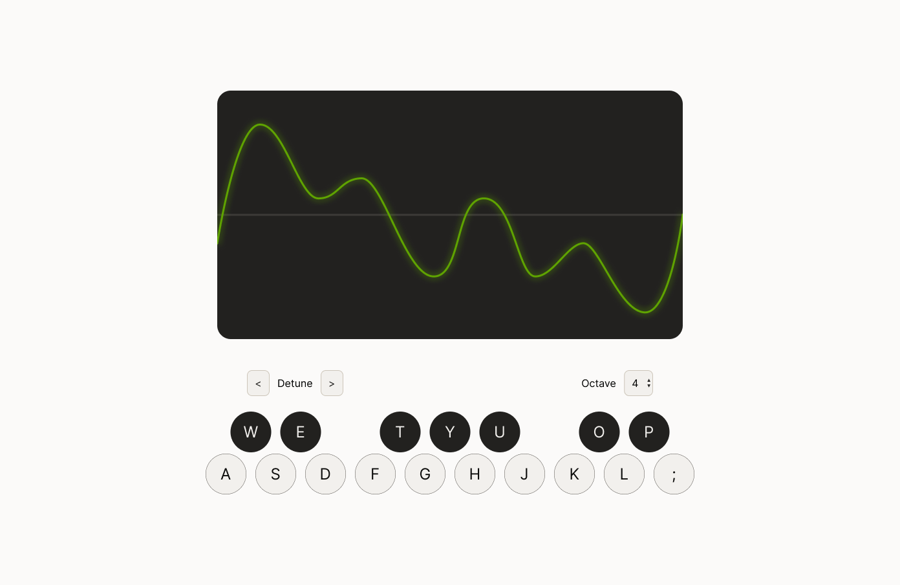

# WaveTable

[WaveTable](https://wavetable.vercel.app/) is a web-based synthesizer heavily inspired by [Serum](https://xferrecords.com/products/serum/).

> 🚧 The synth is still below version `1.0.0`, so the design and features are subject to change quickly

## Design

Check out [the design](https://www.figma.com/design/SUOfDkDqhKT0DEqqgZxkDa/Wavetable?node-id=14-36&t=MqeZoXHTa5FT3Vim-1) in Figma. As the design requirements change, the project will be soon to follow. If you'd like to add a new feature and want to design it yourself, fork the design on figma and add it on your issue or pull request!

## Features

- [x] [Keyboard](https://github.com/gregzanch/wavetable/issues/11)
- [x] [Scope](https://github.com/gregzanch/wavetable/issues/9)
- [x] [Octave Switcher](https://github.com/gregzanch/wavetable/issues/13)
- [x] [Detune Controls](https://github.com/gregzanch/wavetable/issues/20)
- [ ] [ADSR](https://github.com/gregzanch/wavetable/issues/22)
- [ ] [Wavetype Selector](https://github.com/gregzanch/wavetable/issues/21)
- [ ] [Support midi upload and playback](https://github.com/gregzanch/wavetable/issues/12)

## Contributions

Please Contribute! I'd love to collaborate and get some cool features added.